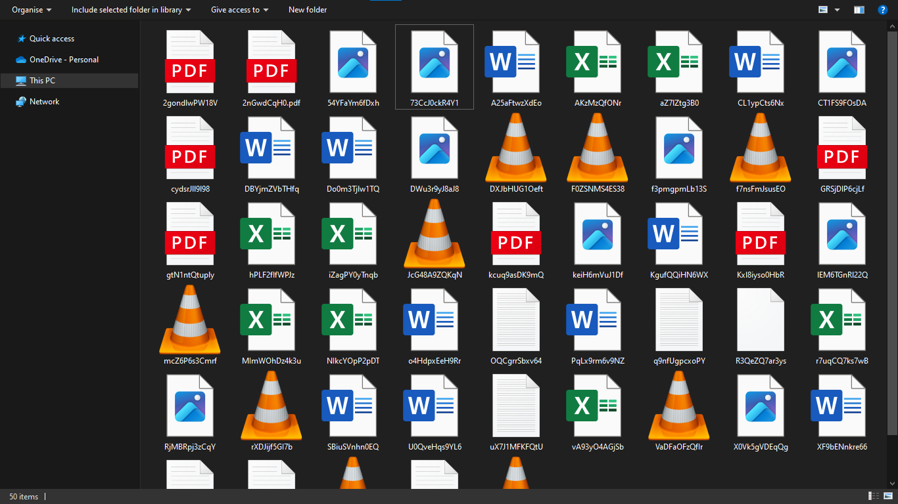
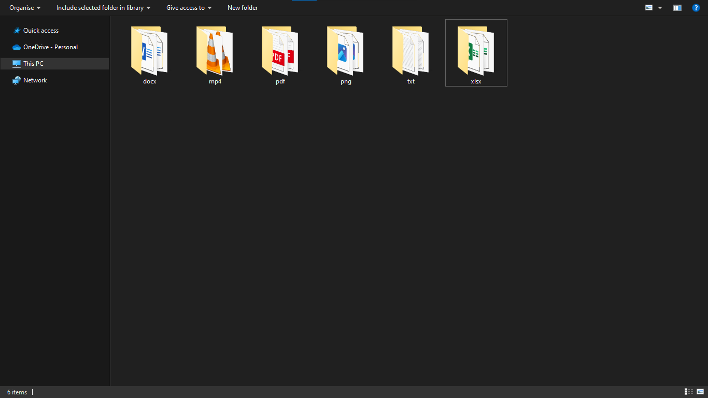

# file_organizer.py

*Author:* Kartikey Tripathi  
*Date:* July 2025  

### ❓ What it does:  
A small and beginner-friendly Python script that helps you organize the mess in any folder.  
It simply looks at all the files in a directory, checks their extensions, and puts them into folders named after those extensions.  
So .jpg files go into a jpg folder, .pdf files into a pdf folder — that kind of stuff.  
Super handy when your Downloads folder looks like a junkyard.

---

## ⚙ What it can do:
- Groups files based on their extensions  
- Auto-creates folders if they’re not already there  
- Skips anything without a proper extension  
- Doesn’t mess with files that already exist (avoids overwriting)  
- Cleans up any empty folders it finds after sorting  
- Lets you pick a custom folder or just works on the current one  
- Treats .JPG and .jpg the same (case-insensitive)

---

## 🧰 What you need:
- Just Python 3.6 or above  
Nothing fancy. If you’ve got Python installed, you’re good to go.

---

## 🏃‍♂ How to run it:

1. Download or clone this repo.
2. Open terminal / command prompt.
3. Run it like this:
   bash
   python file_organizer.py
   
4. Enter the path of the folder you want to clean up, or just hit Enter to use the current one.

---

## 📸 Before & After

**Before:**  

**After:**  

## 🧾 A few things to note:
- It skips hidden files and anything without an extension.
- If a file already exists in the target folder, it won’t be replaced or deleted.
- This is made for personal use, so it keeps things safe and simple.

---

## 🤝 License
This is just a learning project.  
You’re free to use it, change it, mess with it — whatever works for you.

---

Got ideas or ways to make it better?  
Open to suggestions!
